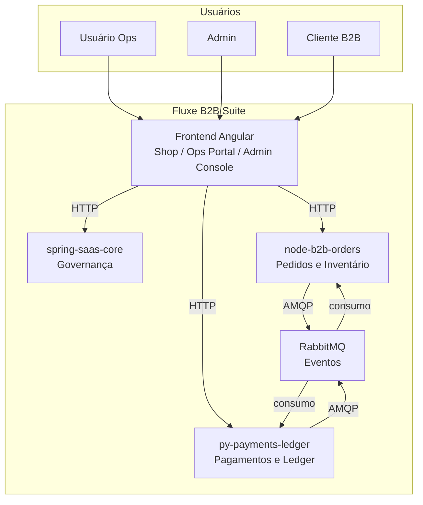
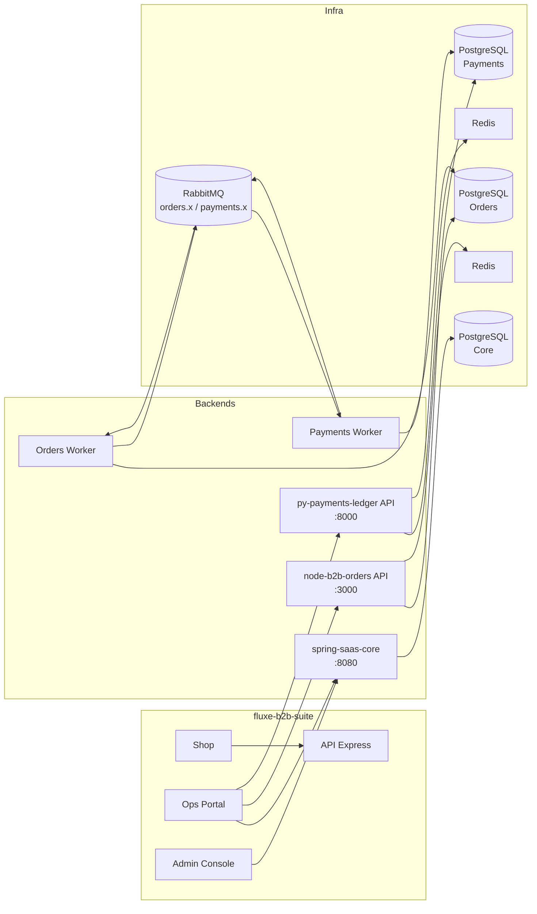
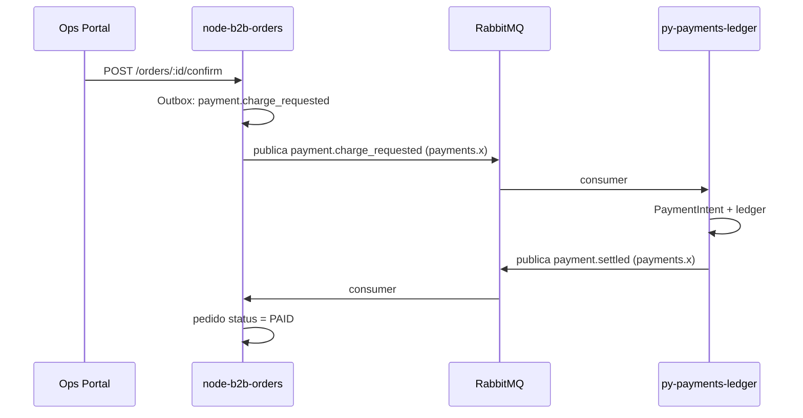

# C4 — Fluxe B2B Suite (Contexto e Container)

Diagramas em Mermaid: nível de **Contexto** (sistema e usuários/sistemas externos) e **Container** (principais aplicações da suite).

---

## Nível 1: Contexto do Sistema

O **Sistema** é a Fluxe B2B Suite. Usuários interagem com o frontend; o frontend e os workers consomem/publicam eventos via RabbitMQ.

---

## Nível 2: Containers (aplicações e filas)

Containers principais: frontend (3 apps + API), Core, Orders (API + Worker), Payments (API + Worker), RabbitMQ.

---

## Fluxo de eventos (Orders ↔ Payments)

---

Para diagramas C4 de um único serviço (ex.: py-payments-ledger), ver a pasta `docs/architecture/` do respectivo repositório.
