# DAS — Documento de Arquitetura de Software

**Plataforma Fluxe B2B Suite**
Versão 1.0 — Março 2026

---

## Sumário

1. [Visão Geral](#1-visão-geral)
2. [C4 — Nível 1: Contexto](#2-c4--nível-1-contexto)
3. [C4 — Nível 2: Containers](#3-c4--nível-2-containers)
4. [C4 — Nível 3: Componentes](#4-c4--nível-3-componentes)
5. [Decisões Arquiteturais (ADRs)](#5-decisões-arquiteturais-adrs)
6. [Fluxos Principais](#6-fluxos-principais)
7. [Infraestrutura](#7-infraestrutura)
8. [Segurança](#8-segurança)
9. [Observabilidade](#9-observabilidade)
10. [Contratos e Eventos](#10-contratos-e-eventos)

---

## 1. Visão Geral

### 1.1 Propósito

A **Fluxe B2B Suite** é uma plataforma SaaS multi-tenant para operações B2B. Centraliza gestão de tenants, pedidos, pagamentos, estoque e governança em uma arquitetura de microsserviços orientada a eventos.

A plataforma permite que múltiplas empresas (tenants) operem de forma isolada dentro da mesma infraestrutura, cada uma com seus planos, políticas de acesso e configurações de funcionalidade.

### 1.2 Escopo

| Capacidade | Descrição |
|---|---|
| Governança multi-tenant | Cadastro de tenants, planos, regiões, políticas ABAC, feature flags, auditoria |
| Pedidos e estoque | Ciclo de vida de pedidos, catálogo de produtos, controle de inventário |
| Pagamentos e contabilidade | Payment intents, ledger double-entry, reconciliação, cobranças recorrentes, faturas |
| Loja B2B | Vitrine de produtos, carrinho, checkout, acompanhamento de pedidos |
| Portal operacional | Gestão de pedidos, estoque, pagamentos e ledger |
| Console administrativo | Gestão de tenants, políticas, flags, auditoria, onboarding |
| IA/LLM | Recomendações de governança, análise de auditoria, documentação viva |

### 1.3 Stakeholders

| Papel | Interesse |
|---|---|
| **Lojista** (Buyer) | Navega catálogo, realiza pedidos, acompanha status e pagamentos via Shop |
| **Operador** (Ops) | Gerencia pedidos, inventário, pagamentos e ledger via Ops Portal |
| **Administrador** (Admin) | Configura tenants, políticas, flags, audita ações via Admin Console |
| **Equipe de plataforma** | Mantém a infraestrutura, monitora SLAs, evolui a arquitetura |
| **Integradores** | Consomem APIs REST e webhooks para integrar sistemas externos |

### 1.4 Serviços da Plataforma

| Serviço | Tecnologia | Porta | Responsabilidade |
|---|---|---|---|
| **spring-saas-core** | Java 21, Spring Boot 3.2 | 8080 | Control plane: tenants, ABAC/RBAC, feature flags, auditoria, JWT, outbox, webhooks, billing, IA |
| **node-b2b-orders** | Node.js, NestJS, Fastify, Prisma | 3000 | Pedidos, produtos, inventário, analytics, outbox, saga |
| **py-payments-ledger** | Python 3.12, FastAPI, SQLAlchemy | 8000 | Pagamentos, ledger double-entry, reconciliação, fraud analytics, cobranças recorrentes, faturas |
| **fluxe-b2b-suite** | Angular, Nx monorepo | 4200/4300/4400 | Frontend: Shop, Ops Portal, Admin Console |

---

## 2. C4 — Nível 1: Contexto

O diagrama de contexto mostra a Fluxe B2B Suite como um sistema único e seus relacionamentos com usuários e sistemas externos.

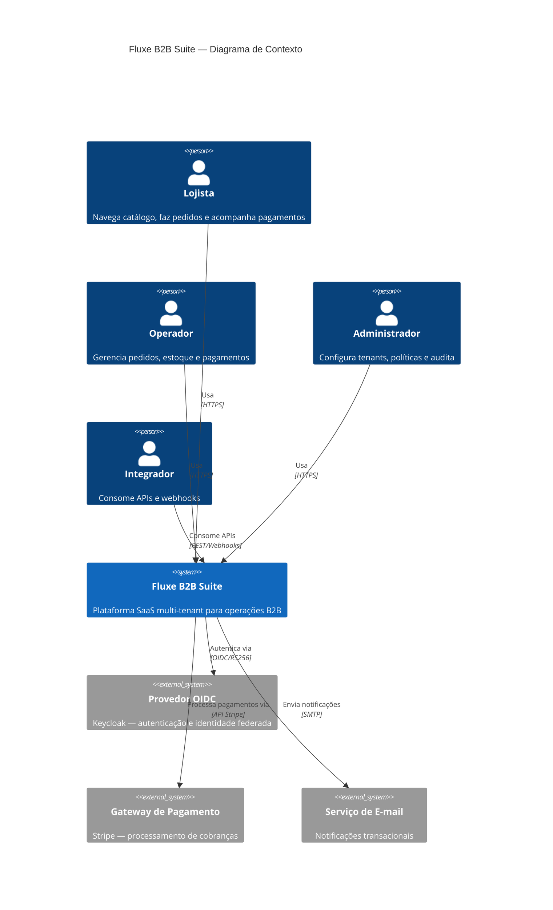

---

## 3. C4 — Nível 2: Containers

O diagrama de containers detalha os serviços, bancos de dados e infraestrutura de mensageria.

```mermaid
C4Container
    title Fluxe B2B Suite — Diagrama de Containers

    Person(lojista, "Lojista")
    Person(operador, "Operador")
    Person(admin, "Administrador")

    System_Boundary(fluxe, "Fluxe B2B Suite") {

        Container(shop, "Shop", "Angular, Nx", "Loja B2B: catálogo, checkout, pedidos")
        Container(ops, "Ops Portal", "Angular, Nx", "Gestão de pedidos, estoque, pagamentos")
        Container(adm, "Admin Console", "Angular, Nx", "Tenants, políticas, flags, auditoria")

        Container(core, "spring-saas-core", "Java 21, Spring Boot 3", "Control plane: tenants, ABAC, flags, audit, JWT, outbox")
        Container(orders, "node-b2b-orders", "Node.js, NestJS, Fastify", "Pedidos, produtos, inventário, analytics, saga")
        Container(payments, "py-payments-ledger", "Python 3.12, FastAPI", "Pagamentos, ledger, reconciliação, fraud")

        Container(orders_worker, "Orders Worker", "Node.js", "Outbox dispatcher, saga, consumers")
        Container(payments_worker, "Payments Worker", "Python", "Outbox dispatcher, consumers, webhooks, reconciliação")

        ContainerDb(pg_core, "PostgreSQL Core", "PostgreSQL 16", "Tenants, políticas, flags, audit, outbox")
        ContainerDb(pg_orders, "PostgreSQL Orders", "PostgreSQL 16", "Pedidos, produtos, inventário, outbox")
        ContainerDb(pg_payments, "PostgreSQL Payments", "PostgreSQL 16", "Pagamentos, ledger, outbox")

        ContainerDb(redis_core, "Redis Core", "Redis 7", "Cache, rate limiting")
        ContainerDb(redis_orders, "Redis Orders", "Redis 7", "Cache, rate limiting, deduplicação")
        ContainerDb(redis_payments, "Redis Payments", "Redis 7", "Rate limiting, idempotência")

        Container(rabbit, "RabbitMQ", "RabbitMQ 3", "Broker de mensagens: saas.events, orders.x, payments.x")
    }

    System_Ext(oidc, "Keycloak OIDC")
    System_Ext(stripe, "Stripe")

    Rel(lojista, shop, "Usa", "HTTPS")
    Rel(operador, ops, "Usa", "HTTPS")
    Rel(admin, adm, "Usa", "HTTPS")

    Rel(shop, orders, "API", "REST/JSON")
    Rel(shop, core, "Auth", "REST/JSON")
    Rel(ops, orders, "API", "REST/JSON")
    Rel(ops, payments, "API", "REST/JSON")
    Rel(adm, core, "API", "REST/JSON")

    Rel(core, pg_core, "Lê/Escreve")
    Rel(core, redis_core, "Cache")
    Rel(orders, pg_orders, "Lê/Escreve")
    Rel(orders, redis_orders, "Cache")
    Rel(payments, pg_payments, "Lê/Escreve")
    Rel(payments, redis_payments, "Cache")

    Rel(core, rabbit, "Publica", "saas.events")
    Rel(orders_worker, rabbit, "Publica/Consome", "orders.x")
    Rel(payments_worker, rabbit, "Publica/Consome", "payments.x")

    Rel(core, oidc, "Valida JWT", "OIDC")
    Rel(payments, stripe, "Processa", "API")
```

### Responsabilidades dos Containers

| Container | Responsabilidade |
|---|---|
| **Shop** | Vitrine de produtos, carrinho, checkout, acompanhamento de pedidos. Auth via `shopAuthGuard`. |
| **Ops Portal** | Dashboard operacional com pedidos, inventário, pagamentos e ledger. Permissões granulares (`orders:read`, `inventory:write`). |
| **Admin Console** | Cadastro de tenants, políticas ABAC, feature flags, visualização de audit log, onboarding, IA. |
| **spring-saas-core** | Fonte única de verdade para tenants, políticas e flags. Emite JWT (HS256/OIDC). Publica eventos de ciclo de vida de tenant via outbox. |
| **node-b2b-orders** | CRUD de pedidos com saga orquestrada pelo worker. Catálogo de produtos. Controle de inventário com reservas. |
| **py-payments-ledger** | Payment intents com idempotência. Ledger double-entry (DEBIT/CREDIT). Reconciliação automática com Stripe. Detecção de fraude. |
| **Orders Worker** | Consome `order.created` para orquestrar reserva de estoque e solicitação de cobrança. Publica no `orders.x` e `payments.x`. |
| **Payments Worker** | Despacha outbox para `payments.x`. Consome eventos de `orders.x` (charge requests) e `saas.x` (tenant lifecycle). Processa webhooks outbound. |
| **RabbitMQ** | Três exchanges topic: `saas.events` (core), `orders.x` (orders), `payments.x` (payments). Dead-letter queues por serviço. |
| **PostgreSQL** | Um banco por serviço (isolamento de dados). Migrações via Liquibase (core), Prisma (orders), Alembic (payments). |
| **Redis** | Uma instância por serviço. Rate limiting por plano do tenant. Cache de flags e políticas. Deduplicação de eventos. |

---

## 4. C4 — Nível 3: Componentes

### 4.1 spring-saas-core

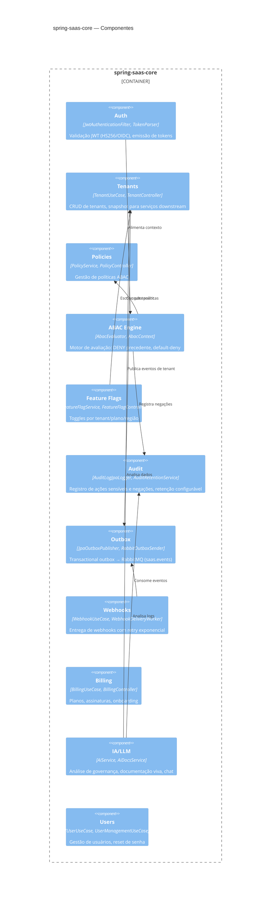

**Arquitetura Hexagonal** — O spring-saas-core segue ports & adapters:

| Camada | Pacote | Exemplos |
|---|---|---|
| Domain | `domain/` | `Tenant`, `Policy`, `FeatureFlag`, `WebhookEndpoint` |
| Application | `application/` | `TenantUseCase`, `AbacEvaluator`, `WebhookUseCase`, `BillingUseCase` |
| Ports | `application/port/` | `OutboxPublisherPort`, `AuditLogger` |
| Adapters In | `adapters/in/rest/`, `adapters/in/auth/` | Controllers REST, `JwtAuthenticationFilter` |
| Adapters Out | `adapters/out/persistence/` | JPA entities, repositories, `JpaOutboxPublisher` |
| Infrastructure | `infrastructure/` | `RabbitOutboxSender`, `AuditRetentionService`, `WebhookDeliveryWorker` |

### 4.2 node-b2b-orders

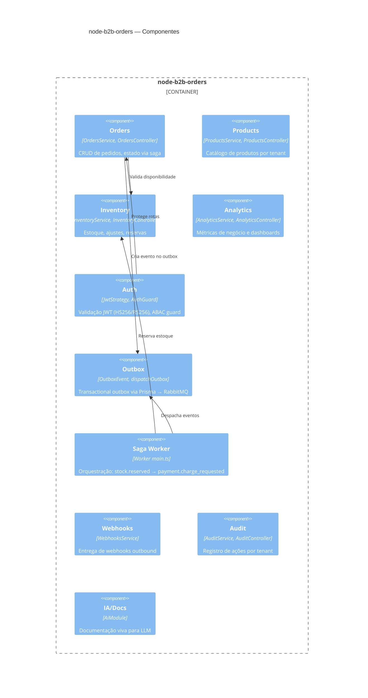

**Stack técnica:** NestJS sobre Fastify, Prisma ORM (PostgreSQL 16), Passport JWT, prom-client (Prometheus), Pino (logging estruturado), Opossum (circuit breaker).

### 4.3 py-payments-ledger

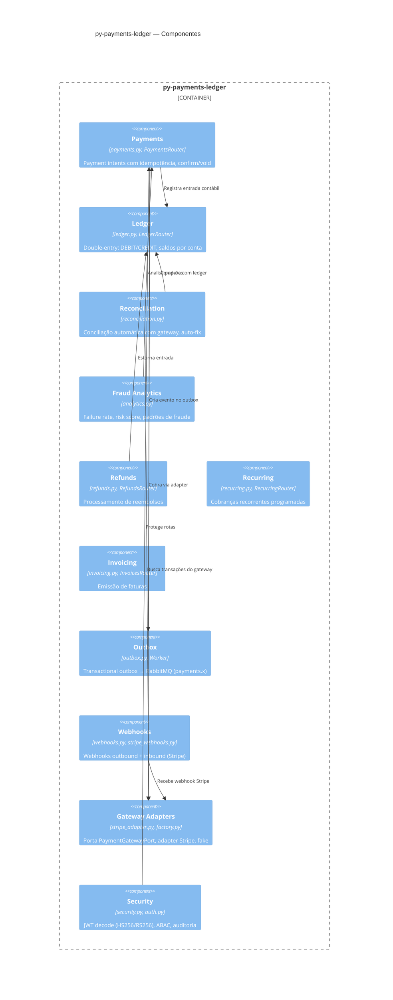

**Stack técnica:** FastAPI (ASGI), SQLAlchemy 2.0 (PostgreSQL 16), Alembic (migrações), pika (RabbitMQ), redis-py, stripe-python, prometheus-client, PyJWT.

### 4.4 fluxe-b2b-suite (Frontend)

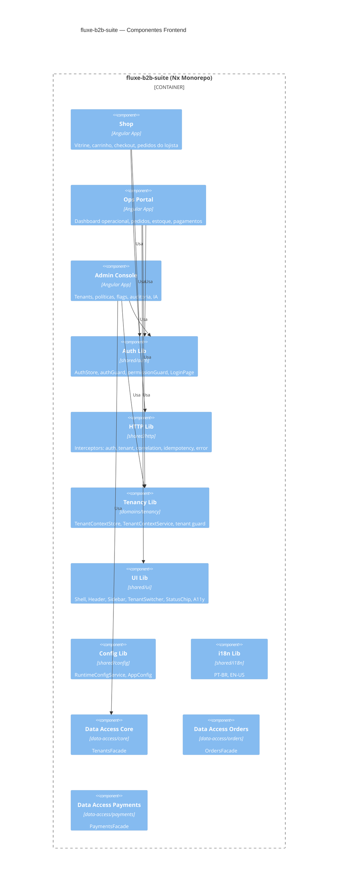

**Stack técnica:** Angular + Nx, Angular Material, Vite (build), Vitest (testes unitários), Playwright (E2E), pnpm, angular-oauth2-oidc (OIDC).

---

## 5. Decisões Arquiteturais (ADRs)

### ADR-001: Multi-tenancy via JWT

**Contexto:** A plataforma precisa isolar dados e regras de acesso entre múltiplos tenants sem bancos separados.

**Decisão:** O JWT emitido pelo spring-saas-core carrega claims de tenant no payload:

```json
{
  "sub": "user-uuid",
  "tid": "tenant-uuid",
  "roles": ["OPERATOR"],
  "perms": ["orders:read", "orders:write"],
  "plan": "PRO",
  "region": "BR",
  "iss": "saas-core"
}
```

Todos os serviços downstream validam o JWT e extraem `tid` para filtrar dados. O header `X-Tenant-Id` é propagado como fallback e para correlação.

**Consequências:**
- (+) Sem necessidade de lookup de tenant a cada request nos serviços downstream.
- (+) Snapshot do tenant no momento da emissão, sem acoplamento síncrono.
- (-) Claims podem ficar stale até a expiração do token.
- (-) Requer rotação segura de chaves (`hs256-secret-previous` para transição).

---

### ADR-002: ABAC sobre RBAC

**Contexto:** RBAC puro não comporta regras baseadas em plano, região, horário ou atributos do recurso.

**Decisão:** Adotar ABAC (Attribute-Based Access Control) com:
- **Políticas** armazenadas no spring-saas-core com `effect: ALLOW | DENY`.
- **DENY precedente** — qualquer política DENY sobrepõe qualquer ALLOW.
- **Default-deny** — sem política aplicável, o acesso é negado.
- Cada serviço implementa um guard ABAC local que avalia atributos do JWT.

**Modelo de avaliação:**

```
AbacContext = { subject (JWT claims), resource, action, environment }
    → AbacEvaluator consulta políticas do tenant
    → Se qualquer política DENY match → ACCESS_DENIED (auditado)
    → Se alguma política ALLOW match → ALLOWED
    → Senão → ACCESS_DENIED (default-deny, auditado)
```

**Consequências:**
- (+) Flexibilidade para regras como "plano FREE não acessa analytics" ou "região EU tem restrições específicas".
- (+) Auditoria completa de negações.
- (-) Mais complexo que RBAC; exige cache de políticas.

---

### ADR-003: Outbox Pattern sobre Publicação Direta

**Contexto:** Publicar eventos diretamente no RabbitMQ a partir de transações de negócio gera inconsistência se o broker estiver indisponível.

**Decisão:** Cada serviço grava eventos em uma tabela `outbox_events` dentro da mesma transação que modifica dados de negócio. Um worker separado lê eventos pendentes, publica no RabbitMQ e marca como `SENT`.

**Implementação por serviço:**

| Serviço | Tabela | Worker | Exchange |
|---|---|---|---|
| spring-saas-core | `outbox_events` (JPA) | `OutboxPublisher` (scheduled) | `saas.events` |
| node-b2b-orders | `OutboxEvent` (Prisma) | `dispatchOutbox()` (loop) | `orders.x` |
| py-payments-ledger | `outbox_events` (SQLAlchemy) | Worker main (loop) | `payments.x` |

**Consequências:**
- (+) Garantia de at-least-once delivery.
- (+) Consistência entre estado local e eventos publicados.
- (-) Possibilidade de eventos duplicados (consumidores devem ser idempotentes).
- (-) Latência adicional entre gravação e publicação.

---

### ADR-004: Arquitetura Hexagonal no spring-saas-core

**Contexto:** O control plane é o serviço com mais regras de domínio; precisa ser testável e extensível.

**Decisão:** Adotar ports & adapters (hexagonal architecture):
- **Domain:** entidades puras (`Tenant`, `Policy`, `FeatureFlag`) sem dependência de framework.
- **Application:** use cases e ports (interfaces).
- **Adapters In:** REST controllers, filtros JWT.
- **Adapters Out:** JPA repositories, RabbitMQ sender.

**Consequências:**
- (+) Testes unitários do domínio sem Spring.
- (+) Facilidade para trocar persistência ou broker.
- (-) Mais classes e indireção comparado a uma arquitetura em camadas simples.

---

### ADR-005: Saga Event-Driven para Fluxo Pedido → Pagamento

**Contexto:** A criação de um pedido envolve reserva de estoque (orders) e cobrança (payments), em serviços distintos.

**Decisão:** Saga coreografada via eventos:

1. `order.created` → Orders Worker reserva estoque → `stock.reserved`
2. `stock.reserved` → Orders Worker solicita cobrança → `payment.charge_requested` (publicado no `payments.x`)
3. Payments consome `payment.charge_requested` → processa → `payment.confirmed` ou `payment.failed`
4. Orders consome resultado → `order.confirmed` ou `order.cancelled`

**Consequências:**
- (+) Desacoplamento total entre orders e payments.
- (+) Compensação automática em caso de falha.
- (-) Complexidade na rastreabilidade; requer `correlationId` e deduplicação.

---

## 6. Fluxos Principais

### 6.1 Saga de Criação de Pedido

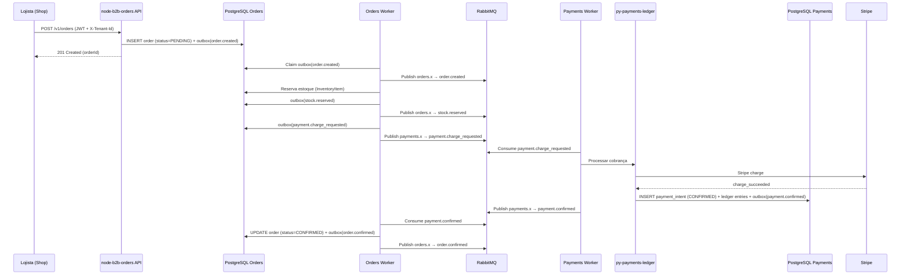

### 6.2 Processamento de Pagamento

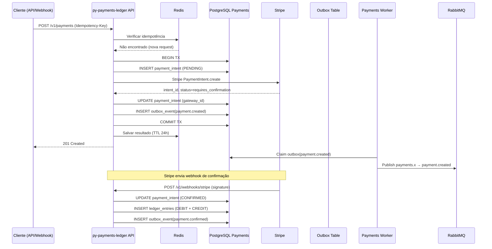

### 6.3 Onboarding de Tenant

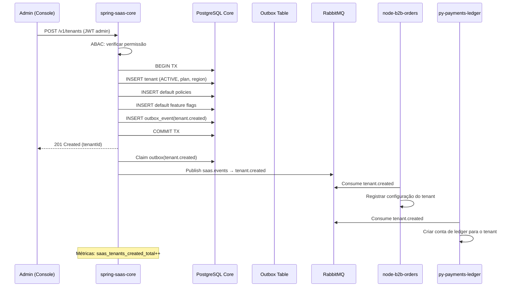

### 6.4 Fluxo de Autenticação JWT

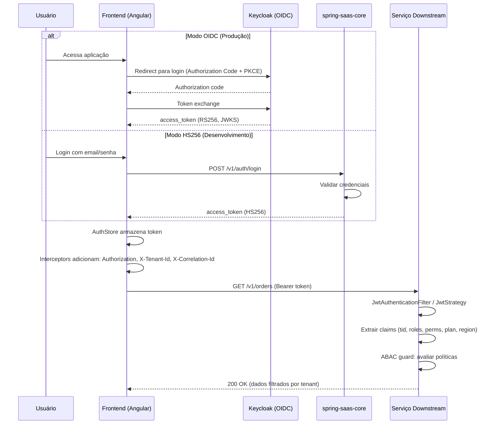

---

## 7. Infraestrutura

### 7.1 Topologia Docker Compose

A plataforma é composta por múltiplos `docker-compose.yml` coordenados pelo script `up-all.sh`.

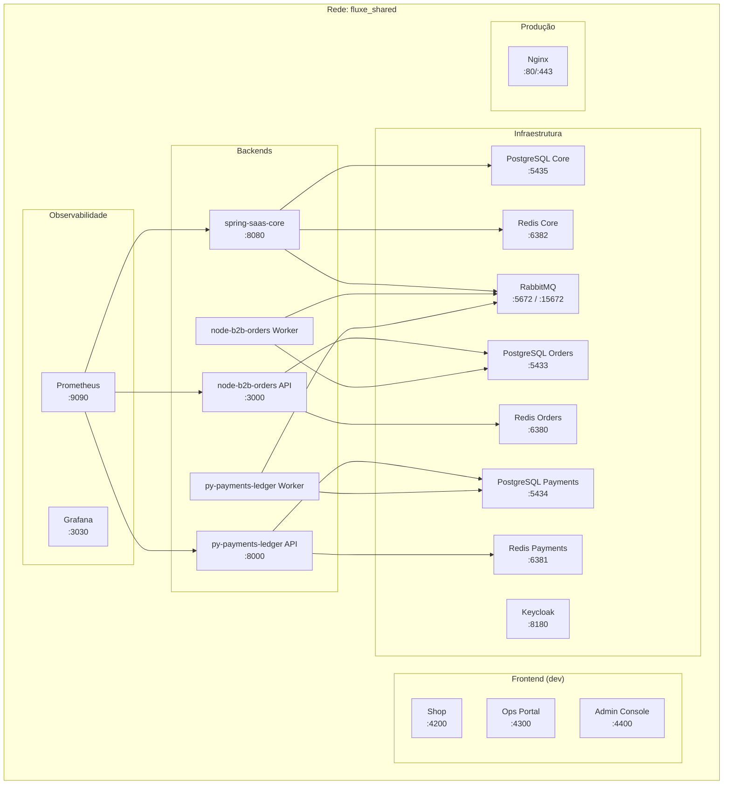

### 7.2 Mapeamento de Portas

| Serviço | Porta Host | Porta Container | Descrição |
|---|---|---|---|
| spring-saas-core | 8080 | 8080 | API REST + Actuator |
| node-b2b-orders API | 3000 | 3000 | API REST + Prometheus |
| py-payments-ledger API | 8000 | 8000 | API REST + Prometheus |
| PostgreSQL Core | 5435 | 5432 | Banco saascore |
| PostgreSQL Orders | 5433 | 5432 | Banco orders |
| PostgreSQL Payments | 5434 | 5432 | Banco payments |
| Redis Core | 6382 | 6379 | Cache core |
| Redis Orders | 6380 | 6379 | Cache orders |
| Redis Payments | 6381 | 6379 | Cache payments |
| RabbitMQ (AMQP) | 5672–5675 | 5672 | AMQP por compose |
| RabbitMQ (Management) | 15672–15675 | 15672 | UI Management |
| Keycloak | 8180 | 8080 | OIDC Provider |
| Prometheus | 9090 | 9090 | Métricas |
| Grafana | 3030 | 3000 | Dashboards |
| Nginx (prod) | 80/443 | 80/443 | Reverse proxy |

### 7.3 Variáveis de Ambiente (Resumo)

| Categoria | Variáveis | Descrição |
|---|---|---|
| Banco de dados | `DATABASE_URL`, `SPRING_DATASOURCE_URL` | Connection string PostgreSQL |
| Redis | `REDIS_URL`, `SPRING_DATA_REDIS_*` | Host/porta do Redis |
| RabbitMQ | `RABBITMQ_URL`, `SPRING_RABBITMQ_*` | Connection string AMQP |
| JWT | `JWT_SECRET`, `JWT_ISSUER`, `JWT_ALGORITHM`, `JWT_SECRET_PREVIOUS` | Emissão/validação de tokens |
| OIDC | `OIDC_ISSUER_URI`, `OIDC_JWK_SET_URI`, `OIDC_CLIENT_ID` | Keycloak (produção) |
| Exchanges | `ORDERS_EXCHANGE`, `PAYMENTS_EXCHANGE`, `SAAS_EXCHANGE` | Nomes dos exchanges RabbitMQ |
| Stripe | `STRIPE_SECRET_KEY`, `STRIPE_WEBHOOK_SECRET` | Gateway de pagamento |
| IA | `AI_ENABLED`, `AI_PROVIDER`, `AI_MODEL`, `AI_API_KEY` | Integração com LLM |
| Rate limit | `RATE_LIMIT_FREE`, `RATE_LIMIT_PRO`, `RATE_LIMIT_ENTERPRISE` | Limites por plano |
| Encryption | `ENCRYPTION_KEY` | AES-256-GCM para dados sensíveis |

### 7.4 Considerações de Deploy

- **Desenvolvimento:** `./scripts/up-all.sh` sobe toda a stack local com Docker Compose.
- **Produção:** `docker-compose.prod.yml` orquestra backends + infra; frontend servido via Nginx com build estático.
- **Cloud:** Terraform configs em `deploy/terraform/` para Oracle Cloud Infrastructure (OCI).
- **CI/CD:** GitHub Actions em cada repositório (`ci.yml`, `build-push.yml`) com imagens GHCR.
- **Migrações:** Executadas automaticamente na inicialização de cada serviço (Liquibase, Prisma migrate, Alembic).
- **Scripts operacionais:** `scripts/up.sh`, `scripts/migrate.sh`, `scripts/seed.sh`, `scripts/smoke.sh` em cada repositório.

---

## 8. Segurança

### 8.1 Estrutura do JWT

```json
{
  "header": {
    "alg": "HS256 | RS256",
    "typ": "JWT"
  },
  "payload": {
    "sub": "user-uuid",
    "tid": "tenant-uuid",
    "roles": ["ADMIN", "OPERATOR"],
    "perms": ["orders:read", "orders:write", "payments:read"],
    "plan": "PRO",
    "region": "BR",
    "iss": "saas-core",
    "iat": 1710000000,
    "exp": 1710003600
  }
}
```

**Modos de operação:**

| Modo | Algoritmo | Uso | Validação |
|---|---|---|---|
| HS256 | HMAC-SHA256 | Desenvolvimento, testes | Chave simétrica compartilhada |
| OIDC/RS256 | RSA-SHA256 | Produção | JWKS endpoint do Keycloak |

**Rotação de chaves:** O campo `jwt.hs256-secret-previous` permite transição suave — tokens emitidos com a chave anterior ainda são aceitos até expirar.

### 8.2 Fluxo de Avaliação ABAC

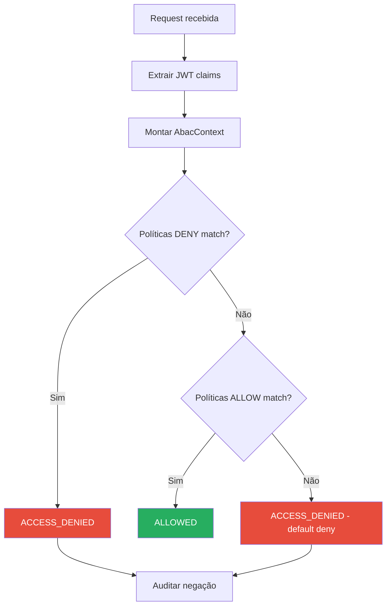

**Atributos avaliados:**

| Categoria | Atributos |
|---|---|
| Subject | `roles`, `perms`, `plan`, `region`, `tid` |
| Resource | tipo, proprietário, estado |
| Action | `read`, `write`, `delete`, `admin` |
| Environment | horário, IP (extensível) |

### 8.3 Criptografia em Repouso

| Aspecto | Implementação |
|---|---|
| Algoritmo | AES-256-GCM |
| Chave | Variável `ENCRYPTION_KEY` (256 bits) |
| Uso | Dados sensíveis no banco (tokens de gateway, secrets de webhook) |
| IV | Gerado aleatoriamente por operação |
| Módulo | `shared/encryption.py` (payments), `infrastructure/security/` (core) |

### 8.4 Rate Limiting

Cada serviço aplica rate limiting por tenant baseado no plano:

| Plano | Limite (req/min) |
|---|---|
| FREE | 60 |
| PRO | 300 |
| ENTERPRISE | 1000 |

**Implementação:**
- **spring-saas-core:** Configuração em `application.yml` (`saas.rate-limit.*`)
- **node-b2b-orders:** Redis + middleware NestJS por `tid` + `sub`
- **py-payments-ledger:** Redis + middleware FastAPI (`rate_limit.py`)

### 8.5 Outras Medidas

| Medida | Implementação |
|---|---|
| CORS | Configurado por profile (`application-prod.yml`, Helmet no NestJS, middleware FastAPI) |
| Helmet | Headers de segurança no NestJS (Fastify Helmet) |
| CSRF | Não aplicável (API stateless com JWT) |
| Input validation | Bean Validation (Spring), class-validator (NestJS), Pydantic (FastAPI) |
| SQL injection | ORM em todos os serviços (JPA, Prisma, SQLAlchemy) |
| Secrets | Nunca em código; `.env` + variáveis de ambiente |

---

## 9. Observabilidade

### 9.1 Métricas Prometheus

Cada serviço expõe métricas no formato Prometheus:

| Serviço | Endpoint | Porta | Métricas de negócio |
|---|---|---|---|
| spring-saas-core | `/actuator/prometheus` | 8080 | `saas_tenants_created_total`, `saas_policies_updated_total`, `saas_flags_toggled_total`, `saas_access_denied_total`, `saas_outbox_published_total`, `saas_outbox_failed_total` |
| node-b2b-orders | `/v1/metrics` | 3000 | Métricas HTTP, pedidos, inventário |
| py-payments-ledger | `/metrics` | 8000 | `payment_intents_created_total`, `payment_intents_confirmed_total`, `outbox_published_total`, `outbox_failed_total`, `outbox_events_pending`, `refunds_total`, `reconciliation_discrepancies_total`, `gateway_requests_total`, `payment_gateway_circuit_breaker_state` |

**Scrape configuration:** Prometheus scrape a cada 5–15 segundos; Grafana com dashboards pré-configurados e alertas.

### 9.2 Logging Estruturado

| Serviço | Biblioteca | Formato |
|---|---|---|
| spring-saas-core | Logback | JSON (produção) |
| node-b2b-orders | Pino | JSON |
| py-payments-ledger | structlog / logging | JSON |

**Campos padrão em todo log:**

```json
{
  "timestamp": "2026-03-12T10:30:00Z",
  "level": "INFO",
  "correlationId": "uuid-v4",
  "tenantId": "tenant-uuid",
  "userId": "user-uuid",
  "service": "node-b2b-orders",
  "message": "Order created",
  "orderId": "order-uuid"
}
```

### 9.3 Propagação de Correlation ID

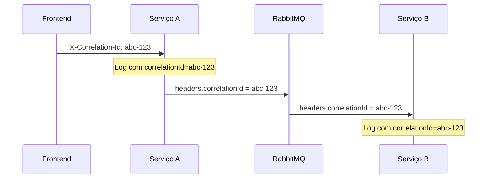

**Geração:** Se ausente, o primeiro serviço gera um UUID v4. O frontend Angular injeta via `correlation.interceptor.ts`.

**Propagação:** Via header HTTP `X-Correlation-Id` em chamadas síncronas e via propriedade `headers.correlationId` em mensagens RabbitMQ.

### 9.4 Health e Readiness Checks

| Serviço | Liveness | Readiness | Verificações de readiness |
|---|---|---|---|
| spring-saas-core | `/actuator/health/liveness` | `/actuator/health/readiness` | PostgreSQL, Redis, RabbitMQ |
| node-b2b-orders | `GET /v1/healthz` | `GET /v1/readyz` | PostgreSQL, Redis |
| py-payments-ledger | `GET /healthz` | `GET /readyz` | PostgreSQL, Redis, RabbitMQ |

---

## 10. Contratos e Eventos

### 10.1 Catálogo de Eventos

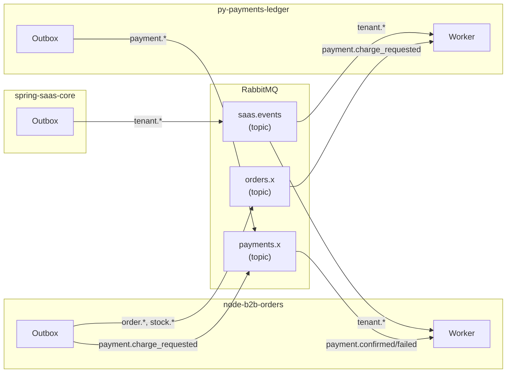

#### Exchange `saas.events` (spring-saas-core → downstream)

| Routing Key | Payload | Consumidores |
|---|---|---|
| `tenant.created` | `{ tenantId, name, plan, region, status }` | orders, payments |
| `tenant.updated` | `{ tenantId, changes }` | orders, payments |
| `tenant.suspended` | `{ tenantId, reason }` | orders, payments |
| `tenant.reactivated` | `{ tenantId }` | orders, payments |
| `policy.updated` | `{ tenantId, policyId, effect, resource, action }` | orders, payments |
| `flag.toggled` | `{ tenantId, flagKey, enabled }` | orders, payments |

#### Exchange `orders.x` (node-b2b-orders)

| Routing Key | Payload | Consumidores |
|---|---|---|
| `order.created` | `{ orderId, tenantId, items, total }` | orders-worker (saga) |
| `order.confirmed` | `{ orderId, tenantId, paymentId }` | — (notificação) |
| `order.cancelled` | `{ orderId, tenantId, reason }` | payments (estorno) |
| `stock.reserved` | `{ orderId, tenantId, items }` | orders-worker (saga) |
| `stock.released` | `{ orderId, tenantId, items }` | — |

#### Exchange `payments.x` (py-payments-ledger)

| Routing Key | Payload | Consumidores |
|---|---|---|
| `payment.charge_requested` | `{ orderId, tenantId, amount, currency }` | payments-worker |
| `payment.created` | `{ paymentId, tenantId, amount, status }` | — |
| `payment.confirmed` | `{ paymentId, tenantId, orderId, amount }` | orders-worker |
| `payment.failed` | `{ paymentId, tenantId, orderId, reason }` | orders-worker |
| `payment.refunded` | `{ paymentId, tenantId, amount }` | — |
| `reconciliation.discrepancy` | `{ tenantId, type, details }` | — (alerta) |

#### Filas e Dead-Letter Queues

| Serviço | Queue | DLQ |
|---|---|---|
| node-b2b-orders | `orders.events` | `orders.dlq` |
| node-b2b-orders | `orders.payments` (consome de `payments.x`) | — |
| py-payments-ledger | `payments.events` | — |
| py-payments-ledger | `payments.orders.events` (consome de `orders.x`) | — |
| py-payments-ledger | `payments.saas.events` (consome de `saas.events`) | — |

### 10.2 Estrutura de Envelope de Evento

Todos os eventos seguem um envelope padronizado:

```json
{
  "eventId": "uuid-v4",
  "eventType": "order.created",
  "aggregateType": "Order",
  "aggregateId": "order-uuid",
  "tenantId": "tenant-uuid",
  "correlationId": "uuid-v4",
  "timestamp": "2026-03-12T10:30:00Z",
  "version": 1,
  "payload": { }
}
```

### 10.3 Estratégia de Versionamento de API

| Aspecto | Estratégia |
|---|---|
| Prefixo | `/v1/` em todos os serviços |
| Compatibilidade | Backward-compatible dentro da mesma major version |
| Depreciação | Header `Deprecation` + documentação com prazo |
| OpenAPI | Exportado para `docs/api/openapi.yaml` e `docs/api/openapi.json` em cada repositório |
| Swagger UI | spring-saas-core: `/docs`, node-b2b-orders: `/v1/docs`, py-payments-ledger: `/docs` |

### 10.4 Headers HTTP Padronizados

| Header | Direção | Descrição |
|---|---|---|
| `Authorization` | Request | `Bearer <JWT>` |
| `X-Tenant-Id` | Request | UUID do tenant ativo |
| `X-Correlation-Id` | Request/Response | UUID para rastreamento end-to-end |
| `Idempotency-Key` | Request | UUID para operações idempotentes (POST) |
| `X-Request-Id` | Response | UUID gerado pelo servidor |
| `X-RateLimit-Limit` | Response | Limite de requests por minuto |
| `X-RateLimit-Remaining` | Response | Requests restantes na janela |

---

## Apêndice A: Referências Cruzadas de Documentação

| Documento | Localização |
|---|---|
| Contrato JWT/Identidade | `docs/contracts/identity.md` (cada repositório) |
| Contrato de Headers | `docs/contracts/headers.md` (cada repositório) |
| Contrato de Eventos | `docs/contracts/events.md` (cada repositório) |
| JSON Schemas de Eventos | `docs/contracts/schemas/` (cada repositório) |
| Prompt de Evolução | `docs/PROMPT-EVOLUCAO.md` (core) |
| Backlog de Evolução | `docs/BACKLOG-EVOLUCAO.md` (cada repositório) |
| Compliance/Auditoria | `docs/compliance.md` (cada repositório) |
| Guia Operacional | `docs/GUIA-OPERACIONAL.md` (fluxe-b2b-suite) |
| Guia de Deploy | `docs/GUIA-DEPLOY-PASSO-A-PASSO.md` (fluxe-b2b-suite) |
| OpenAPI Specs | `docs/api/openapi.yaml` (cada repositório) |

## Apêndice B: Tecnologias e Versões

| Componente | Tecnologia | Versão |
|---|---|---|
| JDK | OpenJDK | 21 |
| Spring Boot | spring-boot-starter | 3.2.5 |
| JJWT | io.jsonwebtoken | 0.12.5 |
| Node.js | Node | 20+ |
| NestJS | @nestjs/core | 10+ |
| Fastify | @nestjs/platform-fastify | 10+ |
| Prisma | prisma | latest |
| Python | CPython | 3.12+ |
| FastAPI | fastapi | latest |
| SQLAlchemy | sqlalchemy | 2.0+ |
| Angular | @angular/core | 21 |
| Nx | nx | latest |
| PostgreSQL | postgres | 16 |
| Redis | redis | 7 |
| RabbitMQ | rabbitmq | 3 (management) |
| Keycloak | keycloak | 26 |
| Prometheus | prom/prometheus | latest |
| Grafana | grafana/grafana | 10.4+ |
| Nginx | nginx | latest |
